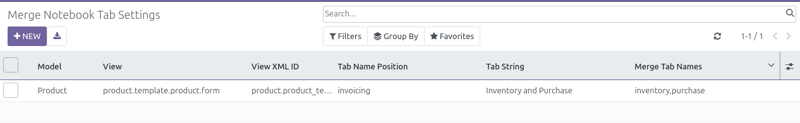

* Go to "Settings > Technical > User Interface > Merge Notebook tab Settings"

* Create a new setting:
    * Select the model of the view you want to change
    * Select the view you want to change
    * Set the description of the tab, that will be displayed to the user. (``string`` parameter)
    * (optionaly) Set the name of the tab, that will be used technically.
      (``name`` parameter). If not set, it will be generated automatically.
    * (optionaly) Set the name of the tab, where the new tab will be inserted.
      (``tab_name_position`` parameter). If not set, the tab will be inserted
      at the first position.
    * set the names of the tabs you want to merge, as a python list.

